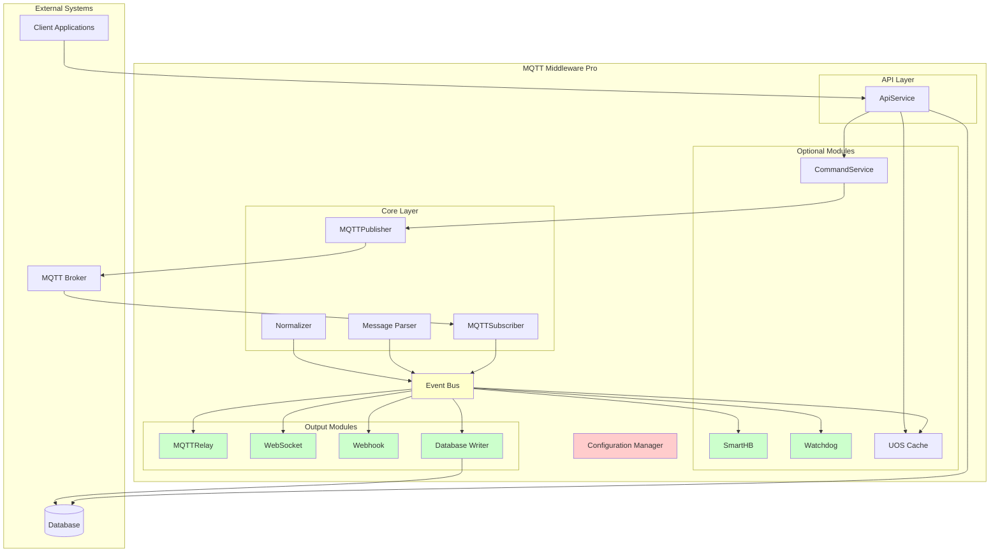
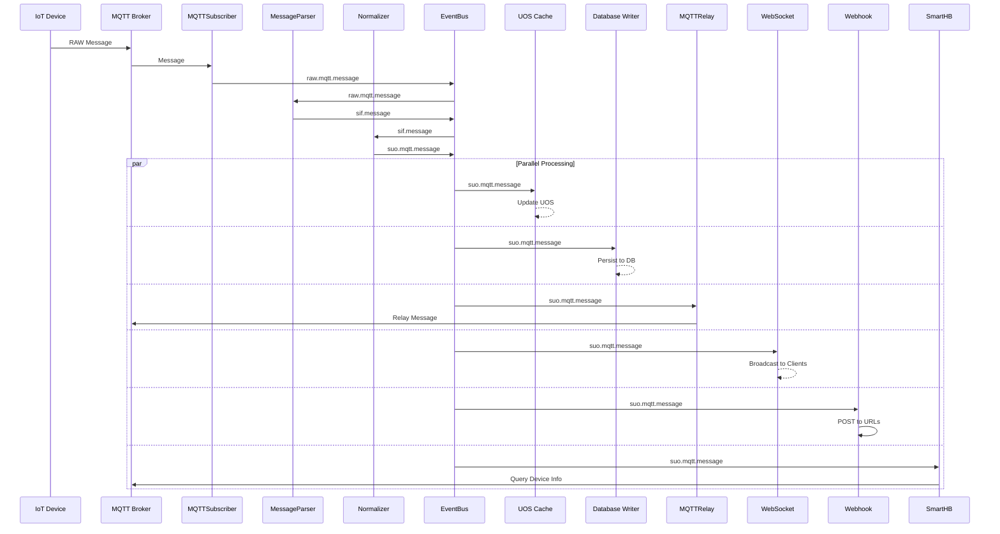
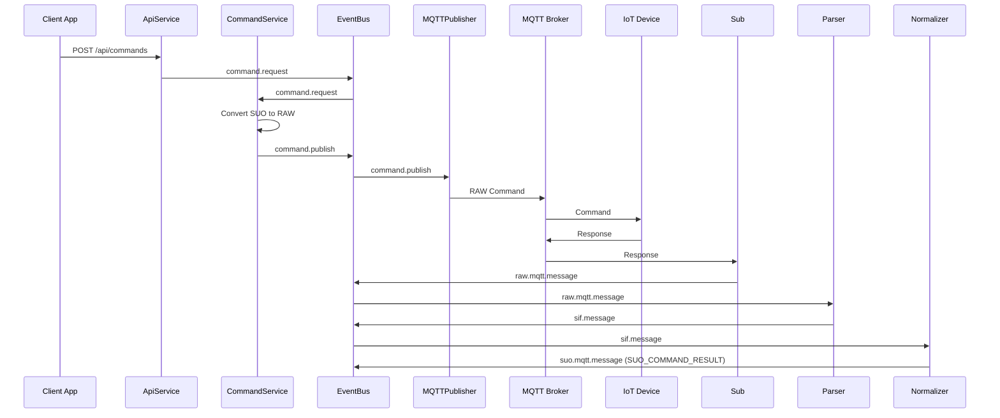
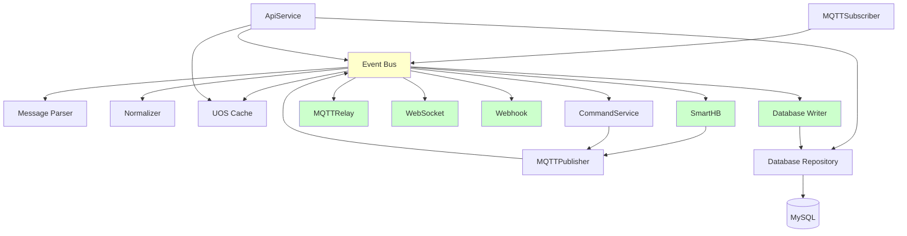

# MQTT Middleware Pro - Architecture Document

**Version:** 1.0  
**Date:** 2026-02-26  
**Status:** Draft

---

## Table of Contents

1. [Overview](#1-overview)
2. [Architectural Principles](#2-architectural-principles)
3. [System Architecture](#3-system-architecture)
4. [Module Design](#4-module-design)
5. [Database Layer](#5-database-layer)
6. [Configuration System](#6-configuration-system)
7. [Folder Structure](#7-folder-structure)
8. [Data Flow](#8-data-flow)
9. [State Model](#9-state-model)
10. [Interfaces](#10-interfaces)
11. [Deployment Considerations](#11-deployment-considerations)

---

## 1. Overview

MQTT Middleware Pro is a modular, high-throughput integration layer designed for flexibility and maintainability. The architecture supports:

- **Independent MQTT Broker**: Configurable broker connection (ActiveMQ for testing)
- **Modular Components**: All major modules can be independently enabled/disabled
- **Event-Driven Architecture**: Loose coupling between components via event bus
- **Scalable Design**: Horizontal scaling support
- **Simple Database Layer**: Direct MySQL implementation (PostgreSQL migration planned for future)

---

## 2. Architectural Principles

### 2.1 Core Principles

| Principle | Description |
|-----------|-------------|
| **Separation of Concerns** | Each module has a single, well-defined responsibility |
| **Dependency Inversion** | High-level modules don't depend on low-level modules; both depend on abstractions |
| **Open/Closed Principle** | Modules are open for extension but closed for modification |
| **Interface Segregation** | Clients depend only on interfaces they use |
| **Configuration-Driven** | Behavior controlled through configuration, not code changes |

### 2.2 Design Patterns

| Pattern | Usage |
|---------|-------|
| **Event-Driven Architecture** | Loose coupling via event bus |
| **Plugin/Module Pattern** | Configurable enable/disable of components |
| **Factory Pattern** | Dynamic module instantiation based on configuration |
| **Observer Pattern** | Event emission and subscription |

---

## 3. System Architecture

### 3.1 High-Level Architecture



### 3.2 Component Configurability

All modules support enable/disable through configuration:

| Module | Config Key | Default | Description |
|--------|------------|---------|-------------|
| SmartHB | `modules.smartHB.enabled` | `true` | Smart Heartbeat processing |
| Watchdog | `modules.watchdog.enabled` | `true` | Scheduled task execution |
| MQTTRelay | `modules.mqttRelay.enabled` | `true` | MQTT message relaying |
| WebSocket | `modules.websocket.enabled` | `true` | WebSocket broadcasting |
| Webhook | `modules.webhook.enabled` | `true` | HTTP webhook delivery |
| Database | `modules.database.enabled` | `true` | Database persistence |

### 3.3 MQTT Broker Independence

The MQTT broker connection is fully configurable:

```typescript
interface MQTTBrokerConfig {
  enabled: boolean;
  host: string;
  port: number;
  protocol: 'mqtt' | 'mqtts' | 'ws' | 'wss';
  username?: string;
  password?: string;
  clientId?: string;
  reconnectPeriod: number;
  connectTimeout: number;
}
```

---

## 4. Module Design

### 4.1 Module Interface

All modules implement a common interface:

```typescript
interface IModule {
  name: string;
  enabled: boolean;
  initialize(): Promise<void>;
  start(): Promise<void>;
  stop(): Promise<void>;
  getStatus(): ModuleStatus;
}

interface ModuleStatus {
  name: string;
  enabled: boolean;
  running: boolean;
  lastError?: Error;
  metrics: Record<string, any>;
}
```

### 4.2 Core Modules (Always Active)

#### 4.2.1 MQTTSubscriber
- **Purpose**: Subscribe to device topics and emit raw messages
- **Dependencies**: EventBus, Config
- **Events Emits**: `raw.mqtt.message`
- **Always Active**: Yes

#### 4.2.2 MQTTPublisher
- **Purpose**: Publish commands to devices
- **Dependencies**: EventBus, Config
- **Events Listens**: `command.publish`
- **Always Active**: Yes

#### 4.2.3 MessageParser
- **Purpose**: Parse RAW messages to SIF format
- **Dependencies**: EventBus
- **Events Listens**: `raw.mqtt.message`
- **Events Emits**: `sif.message`
- **Always Active**: Yes

#### 4.2.4 Normalizer
- **Purpose**: Transform SIF to SUO format
- **Dependencies**: EventBus
- **Events Listens**: `sif.message`
- **Events Emits**: `suo.mqtt.message`
- **Always Active**: Yes

### 4.3 Optional Modules

#### 4.3.1 SmartHB (Configurable)
- **Purpose**: Process heartbeat messages and trigger tasks
- **Dependencies**: EventBus, Cache, MQTTPublisher
- **Events Listens**: `suo.mqtt.message` (filter: SUO_HEARTBEAT)
- **Configurable**: `modules.smartHB.enabled`
- **Tasks**:
  - Query device info if not cached
  - Query module info if not cached
  - Update device online status

#### 4.3.2 Watchdog (Configurable)
- **Purpose**: Execute scheduled health checks and maintenance
- **Dependencies**: EventBus, Config
- **Configurable**: `modules.watchdog.enabled`
- **Scheduled Tasks**:
  - Device health monitoring
  - Cache cleanup
  - Connection health checks
  - Metric collection

#### 4.3.3 UOS Cache (Optional Persistence)
- **Purpose**: In-memory cache for real-time access
- **Dependencies**: EventBus
- **Events Listens**: `suo.mqtt.message`
- **Persistence Options**: Memory, Redis (configurable)

#### 4.3.4 CommandService
- **Purpose**: Handle command requests
- **Dependencies**: EventBus, MQTTPublisher
- **Events Listens**: `command.request`
- **Events Emits**: `command.publish`

### 4.4 Output Modules (All Configurable)

#### 4.4.1 MQTTRelay
- **Purpose**: Relay SUO messages to MQTT topics
- **Dependencies**: EventBus, MQTTPublisher
- **Events Listens**: `suo.mqtt.message`
- **Configurable**: `modules.mqttRelay.enabled`

#### 4.4.2 WebSocket
- **Purpose**: Broadcast SUO to WebSocket clients
- **Dependencies**: EventBus
- **Events Listens**: `suo.mqtt.message`
- **Configurable**: `modules.websocket.enabled`

#### 4.4.3 Webhook
- **Purpose**: POST SUO to HTTP endpoints
- **Dependencies**: EventBus
- **Events Listens**: `suo.mqtt.message`
- **Configurable**: `modules.webhook.enabled`

#### 4.4.4 Database Writer
- **Purpose**: Persist SUO to database
- **Dependencies**: EventBus, DatabaseRepository
- **Events Listens**: `suo.mqtt.message`
- **Configurable**: `modules.database.enabled`

### 4.5 API Layer

#### 4.5.1 ApiService
- **Purpose**: REST API for client applications
- **Dependencies**: Cache, DatabaseRepository, EventBus
- **Always Active**: Yes (if API server is enabled)

---

## 5. Database Layer

**Note:** PostgreSQL migration support is planned for a future version. Current implementation uses MySQL directly.

### 5.1 Database Connection

The database layer uses MySQL directly with a connection pool:

```typescript
interface DatabaseConfig {
  enabled: boolean;
  host: string;
  port: number;
  database: string;
  username: string;
  password: string;
  connectionPool: {
    min: number;
    max: number;
  };
}

class Database {
  private pool: any;
  private config: DatabaseConfig;

  constructor(config: DatabaseConfig) {
    this.config = config;
  }

  async connect(): Promise<void> {
    // Initialize MySQL connection pool
  }

  async disconnect(): Promise<void> {
    // Close connection pool
  }

  async query(sql: string, params?: any[]): Promise<any[]> {
    // Execute query with parameters
  }

  async beginTransaction(): Promise<any> {
    // Begin transaction
  }

  async commitTransaction(tx: any): Promise<void> {
    // Commit transaction
  }

  async rollbackTransaction(tx: any): Promise<void> {
    // Rollback transaction
  }
}
```

### 5.2 SUO Repository

Direct MySQL repository for SUO message persistence:

```typescript
class SUORepository {
  private db: Database;

  constructor(db: Database) {
    this.db = db;
  }

  async saveSUO(suo: SUOMessage): Promise<void> {
    const tableName = this.getTableName(suo.suoType);
    const sql = `INSERT INTO ${tableName} (...) VALUES (...)`;
    await this.db.query(sql, [/* parameters */]);
  }

  async getSUOByType(suoType: string, filter: QueryFilter): Promise<SUOMessage[]> {
    const tableName = this.getTableName(suoType);
    const sql = `SELECT * FROM ${tableName} WHERE ...`;
    return await this.db.query(sql, [/* parameters */]);
  }

  async getLatestSUO(deviceId: string, moduleIndex?: number): Promise<SUOMessage | null> {
    // Query latest SUO for device/module
  }

  async getSUOHistory(deviceId: string, moduleIndex: number, startTime: Date, endTime: Date): Promise<SUOMessage[]> {
    // Query SUO history for time range
  }

  private getTableName(suoType: string): string {
    const mapping: Record<string, string> = {
      'SUO_DEV_MOD': 'suo_dev_mod',
      'SUO_HEARTBEAT': 'suo_heartbeat',
      'SUO_RFID_SNAPSHOT': 'suo_rfid_snapshot',
      'SUO_RFID_EVENT': 'suo_rfid_event',
      'SUO_TEMP_HUM': 'suo_temp_hum',
      'SUO_NOISE_LEVEL': 'suo_noise_level',
      'SUO_DOOR_STATE': 'suo_door_state',
      'SUO_COMMAND_RESULT': 'suo_command_result'
    };
    return mapping[suoType];
  }
}
```

### 5.3 Database Schema

The database schema follows specifications in [`SUO_UOS_DB_Spec.md`](specs/SUO_UOS_DB_Spec.md:559). All tables use MySQL-specific syntax:

- **Auto Increment**: `AUTO_INCREMENT`
- **JSON Type**: `JSON`
- **DATETIME**: `DATETIME(3)` for millisecond precision
- **ENUM**: `ENUM('V5008', 'V6800')` for device types

### 5.4 Future: PostgreSQL Migration

PostgreSQL migration is planned for a future version. When implemented, following approach will be used:

1. Create a database abstraction layer with Repository Pattern
2. Implement MySQL and PostgreSQL adapters
3. Provide migration scripts for schema conversion
4. Support data migration tools (pgloader)

**Note:** This is out of scope for v1.0 and will be addressed in a future release.

---

## 6. Configuration System

### 6.1 Configuration Structure

```typescript
interface AppConfig {
  // Server Configuration
  server: {
    port: number;
    host: string;
    environment: 'development' | 'production' | 'test';
  };

  // MQTT Broker Configuration (Independent)
  mqtt: {
    enabled: boolean;
    broker: {
      host: string;
      port: number;
      protocol: 'mqtt' | 'mqtts' | 'ws' | 'wss';
      username?: string;
      password?: string;
      clientId?: string;
      reconnectPeriod: number;
      connectTimeout: number;
    };
    subscriptions: {
      v5008Topics: string[];
      v6800Topics: string[];
    };
  };

  // Database Configuration (MySQL)
  database: {
    enabled: boolean;
    host: string;
    port: number;
    database: string;
    username: string;
    password: string;
    connectionPool: {
      min: number;
      max: number;
    };
  };

  // Cache Configuration
  cache: {
    type: 'memory' | 'redis';
    maxSize: number;
    defaultTTL: number;
    redis?: {
      host: string;
      port: number;
      password?: string;
    };
  };

  // Module Configuration (Enable/Disable)
  modules: {
    smartHB: {
      enabled: boolean;
      config: {
        queryCooldown: number;
        triggerOnHeartbeat: boolean;
      };
    };
    watchdog: {
      enabled: boolean;
      config: {
        healthCheckInterval: number;
        tasks: ScheduledTask[];
      };
    };
    mqttRelay: {
      enabled: boolean;
      config: {
        topicPatterns: string[];
        qos: number;
        retain: boolean;
      };
    };
    websocket: {
      enabled: boolean;
      config: {
        port: number;
        path: string;
        authentication: {
          enabled: boolean;
          tokenHeader: string;
        };
      };
    };
    webhook: {
      enabled: boolean;
      config: {
        urls: WebhookConfig[];
        retryPolicy: {
          maxRetries: number;
          backoffStrategy: 'exponential' | 'linear';
          initialDelay: number;
        };
        timeout: number;
      };
    };
    database: {
      enabled: boolean;
      config: {
        batchSize: number;
        writeQueueSize: number;
        retryCount: number;
      };
    };
  };

  // API Configuration
  api: {
    enabled: boolean;
    port: number;
    cors: {
      enabled: boolean;
      origins: string[];
    };
    authentication: {
      enabled: boolean;
      jwtSecret: string;
      tokenExpiry: string;
    };
  };

  // Logging Configuration
  logging: {
    level: 'debug' | 'info' | 'warn' | 'error';
    format: 'json' | 'text';
    outputs: ('console' | 'file')[];
    file?: {
      path: string;
      maxSize: string;
      maxFiles: number;
    };
  };
}
```

### 6.2 Configuration Loading

```typescript
class ConfigurationManager {
  private config: AppConfig;
  private configPath: string;

  constructor(configPath: string) {
    this.configPath = configPath;
  }

  async load(): Promise<AppConfig> {
    // Load from file
    const fileConfig = await this.loadFromFile();
    
    // Override with environment variables
    const envConfig = this.loadFromEnvironment();
    
    // Merge configurations
    this.config = this.mergeConfigurations(fileConfig, envConfig);
    
    // Validate configuration
    this.validateConfig(this.config);
    
    return this.config;
  }

  private loadFromFile(): Promise<Partial<AppConfig>> {
    // Support JSON and YAML formats
  }

  private loadFromEnvironment(): Partial<AppConfig> {
    // Map environment variables to config structure
    // Example: MQTT_BROKER_HOST -> mqtt.broker.host
  }

  private mergeConfigurations(base: any, override: any): AppConfig {
    // Deep merge configuration objects
  }

  private validateConfig(config: AppConfig): void {
    // Validate required fields
    // Check module dependencies
  }

  get<T>(path: string): T {
    // Get nested configuration value using dot notation
    // Example: get('modules.smartHB.enabled')
  }
}
```

### 6.3 Module Manager

```typescript
class ModuleManager {
  private modules: Map<string, IModule>;
  private config: AppConfig;

  constructor(config: AppConfig) {
    this.modules = new Map();
    this.config = config;
  }

  async initialize(): Promise<void> {
    // Initialize all enabled modules
    for (const [moduleName, moduleConfig] of Object.entries(this.config.modules)) {
      if (moduleConfig.enabled) {
        const module = await this.createModule(moduleName, moduleConfig);
        this.modules.set(moduleName, module);
        await module.initialize();
      }
    }
  }

  async start(): Promise<void> {
    for (const module of this.modules.values()) {
      if (module.enabled) {
        await module.start();
      }
    }
  }

  async stop(): Promise<void> {
    for (const module of this.modules.values()) {
      await module.stop();
    }
  }

  getModule(name: string): IModule | undefined {
    return this.modules.get(name);
  }

  getAllStatus(): ModuleStatus[] {
    return Array.from(this.modules.values()).map(m => m.getStatus());
  }

  private async createModule(name: string, config: any): Promise<IModule> {
    switch (name) {
      case 'smartHB':
        return new SmartHBModule(config);
      case 'watchdog':
        return new WatchdogModule(config);
      case 'mqttRelay':
        return new MQTTRelayModule(config);
      case 'websocket':
        return new WebSocketModule(config);
      case 'webhook':
        return new WebhookModule(config);
      case 'database':
        return new DatabaseModule(config);
      default:
        throw new Error(`Unknown module: ${name}`);
    }
  }
}
```

---

## 7. Folder Structure

```
mqtt-middleware-pro/
├── src/
│   ├── config/                    # Configuration management
│   │   ├── index.ts
│   │   ├── config.schema.ts       # Configuration schema
│   │   └── default.config.json    # Default configuration
│   │
│   ├── core/                      # Core modules (always active)
│   │   ├── event-bus/
│   │   │   ├── index.ts
│   │   │   ├── event-bus.ts
│   │   │   └── event-types.ts
│   │   │
│   │   ├── mqtt/
│   │   │   ├── index.ts
│   │   │   ├── mqtt-client.ts     # Abstract MQTT client
│   │   │   ├── subscriber.ts
│   │   │   └── publisher.ts
│   │   │
│   │   ├── parser/
│   │   │   ├── index.ts
│   │   │   ├── parser.interface.ts
│   │   │   ├── v5008-parser.ts
│   │   │   └── v6800-parser.ts
│   │   │
│   │   └── normalizer/
│   │       ├── index.ts
│   │       ├── normalizer.ts
│   │       └── transformers/
│   │           ├── dev-mod.transformer.ts
│   │           ├── heartbeat.transformer.ts
│   │           ├── rfid-snapshot.transformer.ts
│   │           ├── rfid-event.transformer.ts
│   │           ├── temp-hum.transformer.ts
│   │           ├── noise-level.transformer.ts
│   │           ├── door-state.transformer.ts
│   │           └── command-result.transformer.ts
│   │
│   ├── modules/                   # Optional modules
│   │   ├── module.interface.ts    # Common module interface
│   │   ├── module-manager.ts
│   │   │
│   │   ├── smart-hb/
│   │   │   ├── index.ts
│   │   │   └── smart-hb.ts
│   │   │
│   │   ├── watchdog/
│   │   │   ├── index.ts
│   │   │   └── watchdog.ts
│   │   │
│   │   ├── cache/
│   │   │   ├── index.ts
│   │   │   ├── cache.interface.ts
│   │   │   ├── memory-cache.ts
│   │   │   └── redis-cache.ts
│   │   │
│   │   └── command/
│   │       ├── index.ts
│   │       └── command-service.ts
│   │
│   ├── output/                   # Output modules (all configurable)
│   │   ├── mqtt-relay/
│   │   │   ├── index.ts
│   │   │   └── mqtt-relay.ts
│   │   │
│   │   ├── websocket/
│   │   │   ├── index.ts
│   │   │   └── websocket-server.ts
│   │   │
│   │   ├── webhook/
│   │   │   ├── index.ts
│   │   │   └── webhook-sender.ts
│   │   │
│   │   └── database/
│   │       ├── index.ts
│   │       └── database-writer.ts
│   │   │
│   ├── database/                 # Database layer (MySQL)
│   │   ├── index.ts
│   │   ├── database.ts
│   │   └── repositories/
│   │       ├── index.ts
│   │       ├── suo.repository.ts
│   │       ├── dev-mod.repository.ts
│   │       ├── heartbeat.repository.ts
│   │       ├── rfid-snapshot.repository.ts
│   │       ├── rfid-event.repository.ts
│   │       ├── temp-hum.repository.ts
│   │       ├── noise-level.repository.ts
│   │       ├── door-state.repository.ts
│   │       └── command-result.repository.ts
│   │   │
│   ├── api/                       # API layer
│   │   ├── index.ts
│   │   ├── server.ts
│   │   ├── routes/
│   │   │   ├── config.routes.ts
│   │   │   ├── health.routes.ts
│   │   │   ├── live.routes.ts
│   │   │   ├── history.routes.ts
│   │   │   └── command.routes.ts
│   │   ├── controllers/
│   │   │   ├── config.controller.ts
│   │   │   ├── health.controller.ts
│   │   │   ├── live.controller.ts
│   │   │   ├── history.controller.ts
│   │   │   └── command.controller.ts
│   │   └── middleware/
│   │       ├── auth.middleware.ts
│   │       ├── cors.middleware.ts
│   │       └── error.middleware.ts
│   │   │
│   ├── types/                     # TypeScript type definitions
│   │   ├── index.ts
│   │   ├── config.types.ts
│   │   ├── event.types.ts
│   │   ├── sif.types.ts
│   │   ├── suo.types.ts
│   │   └── uos.types.ts
│   │   │
│   ├── utils/                     # Utility functions
│   │   ├── index.ts
│   │   ├── logger.ts
│   │   ├── validator.ts
│   │   └── helpers.ts
│   │   │
│   └── app.ts                     # Application entry point
│
├── migrations/                    # Database migrations (MySQL)
│   ├── 001_initial_schema.sql
│   └── 002_add_indexes.sql
│
├── config/                        # Configuration files
│   ├── default.config.json
│   ├── development.config.json
│   ├── production.config.json
│   └── test.config.json
│
├── tests/                         # Test files
│   ├── unit/
│   ├── integration/
│   └── e2e/
│
├── docs/                          # Documentation
│   ├── api.md
│   ├── deployment.md
│   └── migration-guide.md
│
├── package.json
├── tsconfig.json
├── .gitignore
├── README.md
└── architecture.md
```

---

## 8. Data Flow

### 8.1 Message Processing Flow



### 8.2 Command Flow



### 8.3 Event Types

| Event Name | Payload | Emitters | Listeners |
|------------|---------|----------|-----------|
| `raw.mqtt.message` | RawMQTTMessage | MQTTSubscriber | MessageParser |
| `sif.message` | SIFMessage | MessageParser | Normalizer |
| `suo.mqtt.message` | SUOMessage | Normalizer | Cache, DB, Relay, WS, Webhook, SmartHB |
| `command.request` | CommandRequest | ApiService | CommandService |
| `command.publish` | RawCommand | CommandService | MQTTPublisher |
| `module.status.changed` | ModuleStatus | ModuleManager | Monitoring |

---

## 9. State Model

### 9.1 Application State

```typescript
interface ApplicationState {
  status: 'initializing' | 'running' | 'stopping' | 'stopped' | 'error';
  startTime: Date;
  modules: Map<string, ModuleStatus>;
  connections: {
    mqtt: ConnectionStatus;
    database: ConnectionStatus;
    cache: ConnectionStatus;
  };
  metrics: SystemMetrics;
}

interface ConnectionStatus {
  connected: boolean;
  lastConnected?: Date;
  lastError?: Error;
  reconnectAttempts: number;
}

interface SystemMetrics {
  messages: {
    received: number;
    processed: number;
    failed: number;
  };
  devices: {
    online: number;
    offline: number;
    total: number;
  };
  performance: {
    avgProcessingTime: number;
    maxProcessingTime: number;
  };
}
```

### 9.2 UOS Cache State

```typescript
interface UOSCacheState {
  entries: Map<string, UOSCacheEntry>;
  size: number;
  maxSize: number;
  hitRate: number;
  evictions: number;
}

interface UOSCacheEntry {
  key: string;
  deviceId: string;
  moduleIndex: number | null;
  suo: SUOMessage;
  lastUpdated: Date;
  ttl?: number;
  accessCount: number;
}
```

### 9.3 Device State

```typescript
interface DeviceState {
  deviceId: string;
  deviceType: 'V5008' | 'V6800';
  online: boolean;
  lastHeartbeat: Date | null;
  modules: Map<number, ModuleState>;
}

interface ModuleState {
  moduleIndex: number;
  moduleId: string | null;
  online: boolean;
  lastUpdate: Date | null;
}
```

---

## 10. Interfaces

### 10.1 Event Bus Interface

```typescript
interface IEventBus {
  on(event: string, handler: EventHandler): void;
  off(event: string, handler: EventHandler): void;
  emit(event: string, payload: any): void;
  once(event: string, handler: EventHandler): void;
  removeAllListeners(event?: string): void;
}

type EventHandler = (payload: any) => void | Promise<void>;
```

### 10.2 MQTT Client Interface

```typescript
interface IMQTTClient {
  connect(): Promise<void>;
  disconnect(): Promise<void>;
  subscribe(topic: string, qos: number): Promise<void>;
  unsubscribe(topic: string): Promise<void>;
  publish(topic: string, payload: Buffer | string, options?: PublishOptions): Promise<void>;
  on(event: 'message' | 'connect' | 'error', handler: any): void;
  isConnected(): boolean;
}

interface PublishOptions {
  qos: 0 | 1 | 2;
  retain: boolean;
  dup: boolean;
}
```

### 10.3 Cache Interface

```typescript
interface IUOSCache {
  set(key: string, suo: SUOMessage, ttl?: number): void;
  get(key: string): SUOMessage | null;
  getDevice(deviceId: string): SUOMessage[];
  getModule(deviceId: string, moduleIndex: number): SUOMessage | null;
  delete(key: string): boolean;
  clear(): void;
  getStats(): CacheStats;
}

interface CacheStats {
  size: number;
  maxSize: number;
  hitCount: number;
  missCount: number;
  evictionCount: number;
}
```

### 10.4 Parser Interface

```typescript
interface IMessageParser {
  parse(rawMessage: RawMQTTMessage): Promise<SIFMessage>;
  supports(deviceType: string): boolean;
}

interface RawMQTTMessage {
  topic: string;
  payload: Buffer;
  qos: number;
  retain: boolean;
  timestamp: Date;
}

interface SIFMessage {
  meta: MessageMetadata;
  deviceType: 'V5008' | 'V6800';
  deviceId: string;
  messageType: string;
  messageId: string;
  data: any;
}
```

### 10.5 Normalizer Interface

```typescript
interface INormalizer {
  normalize(sifMessage: SIFMessage): Promise<SUOMessage[]>;
  enrichMetadata(suo: SUOMessage): SUOMessage;
}

interface SUOMessage {
  suoType: string;
  deviceId: string;
  deviceType: 'V5008' | 'V6800';
  moduleIndex: number | null;
  moduleId: string | null;
  serverTimestamp: string;
  deviceTimestamp: string | null;
  messageId: string;
  data: any;
}
```

---

## 11. Deployment Considerations

### 11.1 Configuration-Based Deployment

The system can be deployed with different module configurations:

#### Minimal Deployment (Core Only)
```json
{
  "modules": {
    "smartHB": { "enabled": false },
    "watchdog": { "enabled": false },
    "mqttRelay": { "enabled": false },
    "websocket": { "enabled": false },
    "webhook": { "enabled": false },
    "database": { "enabled": false }
  }
}
```

#### Standard Deployment
```json
{
  "modules": {
    "smartHB": { "enabled": true },
    "watchdog": { "enabled": true },
    "mqttRelay": { "enabled": false },
    "websocket": { "enabled": true },
    "webhook": { "enabled": false },
    "database": { "enabled": true }
  }
}
```

#### Full Deployment
```json
{
  "modules": {
    "smartHB": { "enabled": true },
    "watchdog": { "enabled": true },
    "mqttRelay": { "enabled": true },
    "websocket": { "enabled": true },
    "webhook": { "enabled": true },
    "database": { "enabled": true }
  }
}
```

### 11.2 Future: PostgreSQL Migration

PostgreSQL migration is planned for a future version. When implemented, following approach will be considered:

1. Create a database abstraction layer with Repository Pattern
2. Implement MySQL and PostgreSQL adapters
3. Provide migration scripts for schema conversion
4. Support data migration tools (pgloader)

**Note:** This is out of scope for v1.0 and will be addressed in a future release.

### 11.3 MQTT Broker Configuration

#### ActiveMQ (Testing)
```json
{
  "mqtt": {
    "broker": {
      "host": "localhost",
      "port": 1883,
      "protocol": "mqtt",
      "username": "admin",
      "password": "admin"
    }
  }
}
```

#### Mosquitto (Production)
```json
{
  "mqtt": {
    "broker": {
      "host": "mosquitto.example.com",
      "port": 8883,
      "protocol": "mqtts",
      "username": "middleware",
      "password": "secure_password"
    }
  }
}
```

#### EMQX (Production)
```json
{
  "mqtt": {
    "broker": {
      "host": "emqx.example.com",
      "port": 8084,
      "protocol": "wss",
      "username": "middleware",
      "password": "secure_password"
    }
  }
}
```

### 11.4 Docker Deployment

```dockerfile
# Dockerfile
FROM node:18-alpine

WORKDIR /app

COPY package*.json ./
RUN npm ci --only=production

COPY . .

ENV NODE_ENV=production
ENV CONFIG_PATH=/app/config/production.config.json

EXPOSE 3000

CMD ["node", "dist/app.js"]
```

```yaml
# docker-compose.yml
version: '3.8'

services:
  middleware:
    build: .
    ports:
      - "3000:3000"
    environment:
      - NODE_ENV=production
      - DATABASE_HOST=mysql
      - MQTT_BROKER_HOST=emqx
    depends_on:
      - mysql
      - emqx
    volumes:
      - ./config:/app/config

  mysql:
    image: mysql:8.0
    environment:
      MYSQL_DATABASE: mqtt_middleware
      MYSQL_USER: middleware
      MYSQL_PASSWORD: password
      MYSQL_ROOT_PASSWORD: root_password
    volumes:
      - mysql_data:/var/lib/mysql

  emqx:
    image: emqx/emqx:5.0
    ports:
      - "1883:1883"
      - "8083:8083"
      - "8883:8883"
    volumes:
      - emqx_data:/opt/emqx/data

volumes:
  mysql_data:
  emqx_data:
```

### 11.5 Scaling Considerations

#### Horizontal Scaling

For high-throughput deployments:

1. **Load Balancer**: Place a load balancer in front of multiple middleware instances
2. **Shared Cache**: Use Redis instead of in-memory cache
3. **Database Connection Pool**: Configure appropriate pool size
4. **Message Queue**: Use message queue for inter-instance coordination

#### Vertical Scaling

For single-instance optimization:

1. **Increase Workers**: Use Node.js cluster mode
2. **Optimize Cache**: Increase cache size and tune TTL
3. **Database Indexing**: Ensure proper indexes on frequently queried columns
4. **Batch Processing**: Increase batch sizes for database writes

---

## Appendix A: Configuration Examples

### A.1 Development Configuration

```json
{
  "server": {
    "port": 3000,
    "host": "localhost",
    "environment": "development"
  },
  "mqtt": {
    "enabled": true,
    "broker": {
      "host": "localhost",
      "port": 1883,
      "protocol": "mqtt",
      "username": "admin",
      "password": "admin",
      "reconnectPeriod": 1000,
      "connectTimeout": 30000
    },
    "subscriptions": {
      "v5008Topics": ["V5008Upload/#"],
      "v6800Topics": ["V6800Upload/#"]
    }
  },
  "database": {
    "enabled": true,
    "host": "localhost",
    "port": 3306,
    "database": "mqtt_middleware_dev",
    "username": "root",
    "password": "password",
    "connectionPool": {
      "min": 2,
      "max": 10
    }
  },
  "cache": {
    "type": "memory",
    "maxSize": 10000,
    "defaultTTL": 300
  },
  "modules": {
    "smartHB": {
      "enabled": true,
      "config": {
        "queryCooldown": 300,
        "triggerOnHeartbeat": true
      }
    },
    "watchdog": {
      "enabled": true,
      "config": {
        "healthCheckInterval": 60,
        "tasks": []
      }
    },
    "mqttRelay": {
      "enabled": false,
      "config": {
        "topicPatterns": [],
        "qos": 1,
        "retain": false
      }
    },
    "websocket": {
      "enabled": true,
      "config": {
        "port": 3001,
        "path": "/ws",
        "authentication": {
          "enabled": false,
          "tokenHeader": "Authorization"
        }
      }
    },
    "webhook": {
      "enabled": false,
      "config": {
        "urls": [],
        "retryPolicy": {
          "maxRetries": 5,
          "backoffStrategy": "exponential",
          "initialDelay": 1000
        },
        "timeout": 10000
      }
    },
    "database": {
      "enabled": true,
      "config": {
        "batchSize": 100,
        "writeQueueSize": 1000,
        "retryCount": 3
      }
    }
  },
  "api": {
    "enabled": true,
    "port": 3000,
    "cors": {
      "enabled": true,
      "origins": ["*"]
    },
    "authentication": {
      "enabled": false,
      "jwtSecret": "dev-secret",
      "tokenExpiry": "24h"
    }
  },
  "logging": {
    "level": "debug",
    "format": "text",
    "outputs": ["console"]
  }
}
```

### A.2 Production Configuration

```json
{
  "server": {
    "port": 3000,
    "host": "0.0.0.0",
    "environment": "production"
  },
  "mqtt": {
    "enabled": true,
    "broker": {
      "host": "emqx.production.com",
      "port": 8883,
      "protocol": "mqtts",
      "username": "${MQTT_USERNAME}",
      "password": "${MQTT_PASSWORD}",
      "reconnectPeriod": 5000,
      "connectTimeout": 30000
    },
    "subscriptions": {
      "v5008Topics": ["V5008Upload/#"],
      "v6800Topics": ["V6800Upload/#"]
    }
  },
  "database": {
    "enabled": true,
    "host": "${DB_HOST}",
    "port": 3306,
    "database": "mqtt_middleware",
    "username": "${DB_USERNAME}",
    "password": "${DB_PASSWORD}",
    "connectionPool": {
      "min": 5,
      "max": 20
    }
  },
  "cache": {
    "type": "redis",
    "maxSize": 50000,
    "defaultTTL": 300,
    "redis": {
      "host": "${REDIS_HOST}",
      "port": 6379,
      "password": "${REDIS_PASSWORD}"
    }
  },
  "modules": {
    "smartHB": {
      "enabled": true,
      "config": {
        "queryCooldown": 300,
        "triggerOnHeartbeat": true
      }
    },
    "watchdog": {
      "enabled": true,
      "config": {
        "healthCheckInterval": 60,
        "tasks": [
          {
            "name": "device_health_check",
            "interval": 300,
            "enabled": true
          }
        ]
      }
    },
    "mqttRelay": {
      "enabled": true,
      "config": {
        "topicPatterns": ["relay/#"],
        "qos": 1,
        "retain": false
      }
    },
    "websocket": {
      "enabled": true,
      "config": {
        "port": 3001,
        "path": "/ws",
        "authentication": {
          "enabled": true,
          "tokenHeader": "Authorization"
        }
      }
    },
    "webhook": {
      "enabled": true,
      "config": {
        "urls": [
          {
            "url": "https://api.example.com/webhook",
            "headers": {
              "Authorization": "Bearer ${WEBHOOK_TOKEN}"
            }
          }
        ],
        "retryPolicy": {
          "maxRetries": 5,
          "backoffStrategy": "exponential",
          "initialDelay": 1000
        },
        "timeout": 10000
      }
    },
    "database": {
      "enabled": true,
      "config": {
        "batchSize": 100,
        "writeQueueSize": 5000,
        "retryCount": 3
      }
    }
  },
  "api": {
    "enabled": true,
    "port": 3000,
    "cors": {
      "enabled": true,
      "origins": ["https://app.example.com"]
    },
    "authentication": {
      "enabled": true,
      "jwtSecret": "${JWT_SECRET}",
      "tokenExpiry": "24h"
    }
  },
  "logging": {
    "level": "info",
    "format": "json",
    "outputs": ["console", "file"],
    "file": {
      "path": "/var/log/mqtt-middleware/app.log",
      "maxSize": "100M",
      "maxFiles": 10
    }
  }
}
```

---

## Appendix B: Module Dependency Graph



---

**Document End**
