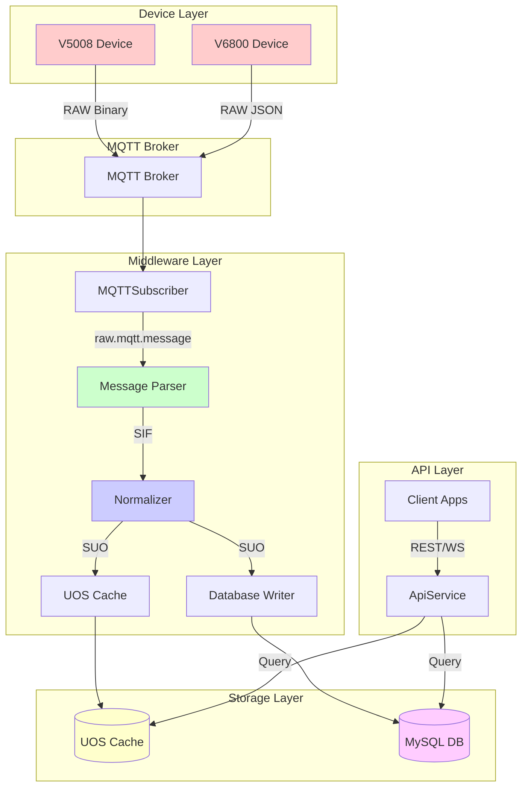

# SUO, UOS, and Database Specification

**File Name:** `SUO_UOS_DB_Spec.md`

**Version:** v1.0

**Date:** 2026-02-25

**Scope:** Specification for SIF to SUO transformation, UOS cache structure, and MySQL database schema for persisting SUO messages

---

## Table of Contents

1. [Overview](#1-overview)
2. [SUO Message Types](#2-suo-message-types)
3. [SIF to SUO Transformation Rules](#3-sif-to-suo-transformation-rules)
4. [SUO Message Schemas](#4-suo-message-schemas)
5. [UOS Cache Structure](#5-uos-cache-structure)
6. [Database Schema](#6-database-schema)
7. [Data Flow Diagram](#7-data-flow-diagram)

---

## 1. Overview

### 1.1 Data Layers

| Layer | Description | Format | Storage |
|-------|-------------|--------|---------|
| **SIF** | Standard Intermediate Format - normalized device data | JSON | Transient |
| **SUO** | Standard Unified Object - enriched with metadata, one per module | JSON | UOS Cache + DB |
| **UOS** | Unified Object Store - in-memory cache for real-time access | In-Memory | Redis/Node.js Memory |
| **DB** | MySQL tables for historical data storage | SQL | MySQL |

### 1.2 Key Design Principles

1. **One SUO per ModuleIndex** - Each SUO message represents data for a single module, except for `SUO_DEV_MOD` and `SUO_HEARTBEAT` which can contain multiple modules
2. **Flattening Rule** - When V6800 SIF contains multiple moduleIndex entries, flatten to individual SUO messages (except `DEV_MOD_INFO` and `HEARTBEAT`)
3. **Unified Metadata** - `SUO_DEV_MOD` combines device and module metadata from both V5008 and V6800 devices
4. **Timestamp Enrichment** - All SUO messages include server-side timestamps for tracking
5. **Consistent Structure** - All SUO messages follow a common structure with device metadata and message-specific data

---

## 2. SUO Message Types

| SUO Type | Description | Source SIF Types | Device Types |
|----------|-------------|------------------|--------------|
| `SUO_DEV_MOD` | Device and module metadata | V5008: DEVICE_INFO, MODULE_INFO, HEARTBEAT<br>V6800: DEV_MOD_INFO, MOD_CHNG_EVENT | V5008, V6800 |
| `SUO_HEARTBEAT` | Device heartbeat status | V5008: HEARTBEAT<br>V6800: HEARTBEAT | V5008, V6800 |
| `SUO_RFID_SNAPSHOT` | Current RFID tag states | V5008: RFID_SNAPSHOT<br>V6800: RFID_SNAPSHOT | V5008, V6800 |
| `SUO_RFID_EVENT` | RFID attach/detach events | V6800: RFID_EVENT | V6800 only |
| `SUO_TEMP_HUM` | Temperature and humidity readings | V5008: TEMP_HUM<br>V6800: TEMP_HUM, QUERY_TEMP_HUM_RESP | V5008, V6800 |
| `SUO_NOISE_LEVEL` | Noise level readings | V5008: NOISE_LEVEL | V5008 only |
| `SUO_DOOR_STATE` | Door open/close state | V5008: DOOR_STATE<br>V6800: DOOR_STATE_EVENT, QUERY_DOOR_STATE_RESP | V5008, V6800 |
| `SUO_COMMAND_RESULT` | Command response results | V5008: QUERY_COLOR_RESP, SET_COLOR_RESP, CLEAR_ALARM_RESP<br>V6800: SET_COLOR_RESP, QUERY_COLOR_RESP, CLEAR_ALARM_RESP | V5008, V6800 |

---

## 3. SIF to SUO Transformation Rules

### 3.1 Common Transformation Rules

All SUO messages include the following common fields:

```json
{
  "suoType": "string",
  "deviceId": "string",
  "deviceType": "V5008" | "V6800",
  "moduleIndex": "number",
  "moduleId": "string",
  "serverTimestamp": "ISO8601",
  "deviceTimestamp": "ISO8601 | null",
  "messageId": "string",
  "data": {}
}
```

| Field | Description | Source |
|-------|-------------|--------|
| `suoType` | Type of SUO message | Derived from SIF messageType |
| `deviceId` | Unique device identifier | SIF.deviceId |
| `deviceType` | Device type (V5008 or V6800) | SIF.deviceType |
| `moduleIndex` | Module index (1-5 for V5008, 1-N for V6800) | SIF.moduleIndex or SIF.data[].moduleIndex |
| `moduleId` | Module serial number | SIF.moduleId or SIF.data[].moduleId |
| `serverTimestamp` | Server-side timestamp when SUO was created | Generated by middleware |
| `deviceTimestamp` | Device-side timestamp (if available) | Extracted from SIF if present |
| `messageId` | Original message ID from device | SIF.messageId |
| `data` | Message-specific data | Transformed from SIF |

### 3.2 Flattening Rule for V6800 Multi-Module Messages

When V6800 SIF messages contain multiple modules in the `data` array, apply the following rules:

**Apply Flattening (Create one SUO per module):**
- `RFID_SNAPSHOT`
- `RFID_EVENT`
- `TEMP_HUM`
- `QUERY_TEMP_HUM_RESP`
- `DOOR_STATE_EVENT`
- `QUERY_DOOR_STATE_RESP`

**Do NOT Apply Flattening (Keep as single SUO with multiple modules):**
- `DEV_MOD_INFO`
- `MOD_CHNG_EVENT`
- `HEARTBEAT`

**Note:** Command response messages (QUERY_COLOR_RESP, SET_COLOR_RESP, CLEAR_ALARM_RESP) are mapped to `SUO_COMMAND_RESULT` instead of flattening to `SUO_RFID_SNAPSHOT`. See Section 4.8 for details.

### 3.3 SUO_DEV_MOD Transformation

`SUO_DEV_MOD` is a special case that combines metadata from multiple SIF sources:

#### V5008 Sources → SUO_DEV_MOD

| SIF Type | Fields Mapped |
|----------|---------------|
| `DEVICE_INFO` | `ip`, `mask`, `gwIp`, `mac`, `model`, `fwVer` (device) |
| `MODULE_INFO` | `moduleIndex`, `moduleId`, `fwVer` (module) |
| `HEARTBEAT` | `moduleIndex`, `moduleId`, `uTotal` |

#### V6800 Sources → SUO_DEV_MOD

| SIF Type | Fields Mapped |
|----------|---------------|
| `DEV_MOD_INFO` | `ip`, `mac`, `moduleIndex`, `moduleId`, `fwVer`, `uTotal` |
| `MOD_CHNG_EVENT` | `moduleIndex`, `moduleId`, `fwVer`, `uTotal` |

**Note:** `SUO_DEV_MOD` can contain multiple modules in the `data` array (no flattening).

---

## 4. SUO Message Schemas

### 4.1 SUO_DEV_MOD

Device and module metadata message.

```json
{
  "suoType": "SUO_DEV_MOD",
  "deviceId": "2437871205",
  "deviceType": "V5008",
  "moduleIndex": null,
  "moduleId": null,
  "serverTimestamp": "2026-02-25T10:30:00.000Z",
  "deviceTimestamp": null,
  "messageId": "654367990",
  "data": {
    "ip": "192.168.0.211",
    "mask": "255.255.0.0",
    "gwIp": "192.168.0.1",
    "mac": "80:82:91:4E:F6:65",
    "model": "2509",
    "fwVer": "2509101151",
    "modules": [
      {
        "moduleIndex": 1,
        "moduleId": "1234567890",
        "fwVer": "2509101151",
        "uTotal": 54
      },
      {
        "moduleIndex": 2,
        "moduleId": "1234567891",
        "fwVer": "2509101152",
        "uTotal": 54
      }
    ]
  }
}
```

**Fields:**

| Field | Type | Description |
|-------|------|-------------|
| `moduleIndex` | null | Always null for device-level metadata |
| `moduleId` | null | Always null for device-level metadata |
| `data.ip` | string | Device IP address |
| `data.mask` | string | Network mask |
| `data.gwIp` | string | Gateway IP address |
| `data.mac` | string | MAC address |
| `data.model` | string | Device model |
| `data.fwVer` | string | Device firmware version |
| `data.modules[]` | array | Array of module information |
| `data.modules[].moduleIndex` | number | Module index |
| `data.modules[].moduleId` | string | Module serial number |
| `data.modules[].fwVer` | string | Module firmware version |
| `data.modules[].uTotal` | number | Total number of sensors (U positions) |

### 4.2 SUO_HEARTBEAT

Device heartbeat status message.

```json
{
  "suoType": "SUO_HEARTBEAT",
  "deviceId": "2437871205",
  "deviceType": "V5008",
  "moduleIndex": null,
  "moduleId": null,
  "serverTimestamp": "2026-02-25T10:30:00.000Z",
  "deviceTimestamp": null,
  "messageId": "654367990",
  "data": {
    "modules": [
      {
        "moduleIndex": 1,
        "moduleId": "1234567890",
        "uTotal": 54,
        "onlineCount": 54
      },
      {
        "moduleIndex": 2,
        "moduleId": "1234567891",
        "uTotal": 54,
        "onlineCount": 53
      }
    ],
    "busVoltage": "12.5",
    "busCurrent": "2.3",
    "mainPower": 1,
    "backupPower": 0
  }
}
```

**Fields:**

| Field | Type | Description |
|-------|------|-------------|
| `moduleIndex` | null | Always null for device-level heartbeat |
| `moduleId` | null | Always null for device-level heartbeat |
| `data.modules[]` | array | Array of module heartbeat status |
| `data.modules[].moduleIndex` | number | Module index |
| `data.modules[].moduleId` | string | Module serial number |
| `data.modules[].uTotal` | number | Total number of sensors |
| `data.modules[].onlineCount` | number | Number of online sensors |
| `data.busVoltage` | string | Bus voltage (V6800 only) |
| `data.busCurrent` | string | Bus current (V6800 only) |
| `data.mainPower` | number | Main power status (V6800 only) |
| `data.backupPower` | number | Backup power status (V6800 only) |

### 4.3 SUO_RFID_SNAPSHOT

Current RFID tag states for a specific module.

```json
{
  "suoType": "SUO_RFID_SNAPSHOT",
  "deviceId": "2437871205",
  "deviceType": "V5008",
  "moduleIndex": 2,
  "moduleId": "1234567891",
  "serverTimestamp": "2026-02-25T10:30:00.000Z",
  "deviceTimestamp": null,
  "messageId": "654367990",
  "data": {
    "sensors": [
      {
        "sensorIndex": 1,
        "tagId": "DD344A44",
        "isAlarm": false
      },
      {
        "sensorIndex": 2,
        "tagId": "DD344A45",
        "isAlarm": true
      },
      {
        "sensorIndex": 3,
        "tagId": null,
        "isAlarm": false
      }
    ]
  }
}
```

**Fields:**

| Field | Type | Description |
|-------|------|-------------|
| `moduleIndex` | number | Module index (1-5 for V5008, 1-N for V6800) |
| `moduleId` | string | Module serial number |
| `data.sensors[]` | array | Array of sensor RFID states |
| `data.sensors[].sensorIndex` | number | Sensor index (1-54) |
| `data.sensors[].tagId` | string \| null | Tag ID (hex string), null if no tag |
| `data.sensors[].isAlarm` | boolean | Alarm status |

### 4.4 SUO_RFID_EVENT

RFID attach/detach event for a specific module (V6800 only).

```json
{
  "suoType": "SUO_RFID_EVENT",
  "deviceId": "2437871205",
  "deviceType": "V6800",
  "moduleIndex": 4,
  "moduleId": "1234567893",
  "serverTimestamp": "2026-02-25T10:30:00.000Z",
  "deviceTimestamp": null,
  "messageId": "uuid-12345",
  "data": {
    "sensorIndex": 10,
    "tagId": "DD344A44",
    "action": "ATTACHED",
    "isAlarm": false
  }
}
```

**Fields:**

| Field | Type | Description |
|-------|------|-------------|
| `moduleIndex` | number | Module index |
| `moduleId` | string | Module serial number |
| `data.sensorIndex` | number | Sensor index |
| `data.tagId` | string | Tag ID (hex string) |
| `data.action` | string | Event action: "ATTACHED" or "DETACHED" |
| `data.isAlarm` | boolean | Alarm status |

### 4.5 SUO_TEMP_HUM

Temperature and humidity readings for a specific module.

```json
{
  "suoType": "SUO_TEMP_HUM",
  "deviceId": "2437871205",
  "deviceType": "V5008",
  "moduleIndex": 2,
  "moduleId": "1234567891",
  "serverTimestamp": "2026-02-25T10:30:00.000Z",
  "deviceTimestamp": null,
  "messageId": "654367990",
  "data": {
    "sensors": [
      {
        "sensorIndex": 10,
        "temp": 25.50,
        "hum": 60.25
      },
      {
        "sensorIndex": 11,
        "temp": null,
        "hum": null
      },
      {
        "sensorIndex": 12,
        "temp": 26.00,
        "hum": 58.50
      }
    ]
  }
}
```

**Fields:**

| Field | Type | Description |
|-------|------|-------------|
| `moduleIndex` | number | Module index |
| `moduleId` | string | Module serial number |
| `data.sensors[]` | array | Array of sensor readings |
| `data.sensors[].sensorIndex` | number | Sensor index (10-15 for V5008, varies for V6800) |
| `data.sensors[].temp` | number \| null | Temperature in Celsius, null if invalid |
| `data.sensors[].hum` | number \| null | Humidity in %, null if invalid |

### 4.6 SUO_NOISE_LEVEL

Noise level readings for a specific module (V5008 only).

```json
{
  "suoType": "SUO_NOISE_LEVEL",
  "deviceId": "2437871205",
  "deviceType": "V5008",
  "moduleIndex": 2,
  "moduleId": "1234567891",
  "serverTimestamp": "2026-02-25T10:30:00.000Z",
  "deviceTimestamp": null,
  "messageId": "654367990",
  "data": {
    "sensors": [
      {
        "sensorIndex": 16,
        "noise": 45.50
      },
      {
        "sensorIndex": 17,
        "noise": null
      },
      {
        "sensorIndex": 18,
        "noise": 48.25
      }
    ]
  }
}
```

**Fields:**

| Field | Type | Description |
|-------|------|-------------|
| `moduleIndex` | number | Module index (1-5) |
| `moduleId` | string | Module serial number |
| `data.sensors[]` | array | Array of sensor readings |
| `data.sensors[].sensorIndex` | number | Sensor index (16-18) |
| `data.sensors[].noise` | number \| null | Noise level in dB, null if invalid |

### 4.7 SUO_DOOR_STATE

Door open/close state for a specific module.

```json
{
  "suoType": "SUO_DOOR_STATE",
  "deviceId": "2437871205",
  "deviceType": "V5008",
  "moduleIndex": 2,
  "moduleId": "1234567891",
  "serverTimestamp": "2026-02-25T10:30:00.000Z",
  "deviceTimestamp": null,
  "messageId": "654367990",
  "data": {
    "door1State": 1,
    "door2State": null
  }
}
```

**Fields:**

| Field | Type | Description |
|-------|------|-------------|
| `moduleIndex` | number | Module index |
| `moduleId` | string | Module serial number |
| `data.door1State` | number \| null | Door 1 state (0=closed, 1=open), null if not available |
| `data.door2State` | number \| null | Door 2 state (0=closed, 1=open), null if not available (V6800 dual door only) |

---

## 4.8 SUO_COMMAND_RESULT

Command response result message for query and set operations.

```json
{
  "suoType": "SUO_COMMAND_RESULT",
  "deviceId": "2437871205",
  "deviceType": "V5008",
  "moduleIndex": 1,
  "moduleId": "1234567890",
  "serverTimestamp": "2026-02-25T10:30:00.000Z",
  "deviceTimestamp": null,
  "messageId": "654367990",
  "data": {
    "commandType": "QUERY_COLOR",
    "result": "Success",
    "originalReq": "E401"
  }
}
```

**Fields:**

| Field | Type | Description |
|-------|------|-------------|
| `moduleIndex` | number | Module index |
| `moduleId` | string | Module serial number |
| `data.commandType` | string | Type of command that was executed |
| `data.result` | string | Command result: "Success" or "Failure" |
| `data.originalReq` | string | Original request data (hex string) |
| `data.colorCodes` | array | Color codes for sensors (QUERY_COLOR_RESP only) |
| `data.sensorIndex` | number | Sensor index (CLEAR_ALARM_RESP only) |

---

## 5. UOS Cache Structure

### 5.1 Overview

The UOS (Unified Object Store) is an in-memory cache that stores the latest SUO message for each device-module combination. It provides fast access to real-time device state for API queries.

### 5.2 Cache Key Structure

The UOS cache uses a composite key for storing SUO messages:

```
Key Format: {deviceId}:{type}:{identifier}
```

**Examples:**
- `2437871205:dev:0` - Device 2437871205, Device-level metadata (SUO_DEV_MOD)
- `2437871205:hb:0` - Device 2437871205, Device heartbeat (SUO_HEARTBEAT)
- `2437871205:mod:1` - Device 2437871205, Module 1
- `2437871205:mod:2` - Device 2437871205, Module 2
- `2437871205:cmd:1` - Device 2437871205, Command result for Module 1 (SUO_COMMAND_RESULT)

**Key Format Legend:**
- `dev` - Device-level metadata (SUO_DEV_MOD)
- `hb` - Device heartbeat (SUO_HEARTBEAT)
- `mod` - Module-level data
- `cmd` - Command result data (SUO_COMMAND_RESULT)

### 5.3 Cache Value Structure

Each cache entry contains:

```typescript
interface UOSCacheEntry {
  key: string;              // "{deviceId}:{moduleIndex}"
  deviceId: string;
  moduleIndex: number | null;
  suo: SUOMessage;          // The latest SUO message
  lastUpdated: Date;        // Timestamp of last update
  ttl?: number;             // Time-to-live in seconds (optional)
}
```

### 5.4 Cache Operations

| Operation | Description |
|-----------|-------------|
| `set(key, suo)` | Store or update SUO message |
| `get(key)` | Retrieve latest SUO message |
| `getDevice(deviceId)` | Retrieve all SUO messages for a device |
| `getModule(deviceId, moduleIndex)` | Retrieve SUO for specific module |
| `delete(key)` | Remove cache entry |
| `clear()` | Clear all cache entries |
| `expire(key, ttl)` | Set expiration time for entry |

### 5.5 Cache Eviction Policy

- **TTL-based**: Entries expire after a configurable time-to-live (default: 5 minutes)
- **LRU-based**: When cache is full, least recently used entries are evicted
- **Manual**: Device offline events trigger cache cleanup

### 5.6 Cache Indexes

For efficient querying, maintain the following indexes:

| Index | Key | Purpose |
|-------|-----|---------|
| Primary | `{deviceId}:{type}:{identifier}` | Direct lookup |
| Device | `{deviceId}` | Get all data for a device |
| DeviceType | `{deviceType}` | Get all devices of a type |
| ModuleId | `{moduleId}` | Find module by serial number |

---

## 6. Database Schema

### 6.1 Overview

The MySQL database stores historical SUO messages for querying and analytics. Each SUO type has its own table optimized for that type of data.

### 6.2 Common Table Columns

All SUO tables include the following common columns:

| Column | Type | Description |
|--------|------|-------------|
| `id` | BIGINT UNSIGNED AUTO_INCREMENT PRIMARY KEY | Unique record ID |
| `device_id` | VARCHAR(64) NOT NULL | Device identifier |
| `device_type` | ENUM('V5008', 'V6800') NOT NULL | Device type |
| `module_index` | INT NULL | Module index (null for device-level) |
| `module_id` | VARCHAR(64) NULL | Module serial number |
| `server_timestamp` | DATETIME(3) NOT NULL | Server timestamp (milliseconds) |
| `device_timestamp` | DATETIME(3) NULL | Device timestamp (if available) |
| `message_id` | VARCHAR(64) NULL | Original message ID |
| `created_at` | DATETIME(3) NOT NULL DEFAULT CURRENT_TIMESTAMP(3) | Record creation time |

### 6.3 Indexes

All tables include the following indexes:

```sql
-- Primary key
PRIMARY KEY (id)

-- Device and module lookup
INDEX idx_device_module (device_id, module_index, server_timestamp DESC)

-- Time-based queries
INDEX idx_server_timestamp (server_timestamp DESC)

-- Device type queries
INDEX idx_device_type (device_type)

-- Message ID lookup
INDEX idx_message_id (message_id)
```

### 6.4 Table Schemas

#### 6.4.1 Table: `suo_dev_mod`

Stores device and module metadata.

```sql
CREATE TABLE suo_dev_mod (
  id BIGINT UNSIGNED AUTO_INCREMENT PRIMARY KEY,
  device_id VARCHAR(64) NOT NULL,
  device_type ENUM('V5008', 'V6800') NOT NULL,
  module_index INT NULL,
  module_id VARCHAR(64) NULL,
  server_timestamp DATETIME(3) NOT NULL,
  device_timestamp DATETIME(3) NULL,
  message_id VARCHAR(64) NULL,
  created_at DATETIME(3) NOT NULL DEFAULT CURRENT_TIMESTAMP(3),
  
  -- Device metadata
  ip VARCHAR(45) NULL,
  mask VARCHAR(45) NULL,
  gw_ip VARCHAR(45) NULL,
  mac VARCHAR(17) NULL,
  model VARCHAR(64) NULL,
  fw_ver VARCHAR(64) NULL,
  
  -- Module metadata (JSON array for multiple modules)
  modules JSON NULL,
  
  INDEX idx_device_module (device_id, server_timestamp DESC),
  INDEX idx_server_timestamp (server_timestamp DESC),
  INDEX idx_device_type (device_type)
) ENGINE=InnoDB DEFAULT CHARSET=utf8mb4;
```

**`modules` JSON Structure:**
```json
[
  {
    "moduleIndex": 1,
    "moduleId": "1234567890",
    "fwVer": "2509101151",
    "uTotal": 54
  }
]
```

#### 6.4.2 Table: `suo_heartbeat`

Stores device heartbeat messages.

```sql
CREATE TABLE suo_heartbeat (
  id BIGINT UNSIGNED AUTO_INCREMENT PRIMARY KEY,
  device_id VARCHAR(64) NOT NULL,
  device_type ENUM('V5008', 'V6800') NOT NULL,
  module_index INT NULL,
  module_id VARCHAR(64) NULL,
  server_timestamp DATETIME(3) NOT NULL,
  device_timestamp DATETIME(3) NULL,
  message_id VARCHAR(64) NULL,
  created_at DATETIME(3) NOT NULL DEFAULT CURRENT_TIMESTAMP(3),
  
  -- Power status (V6800 only)
  bus_voltage VARCHAR(10) NULL,
  bus_current VARCHAR(10) NULL,
  main_power TINYINT NULL,
  backup_power TINYINT NULL,
  
  -- Module heartbeat data (JSON array)
  modules JSON NULL,
  
  INDEX idx_device_module (device_id, server_timestamp DESC),
  INDEX idx_server_timestamp (server_timestamp DESC),
  INDEX idx_device_type (device_type)
) ENGINE=InnoDB DEFAULT CHARSET=utf8mb4;
```

**`modules` JSON Structure:**
```json
[
  {
    "moduleIndex": 1,
    "moduleId": "1234567890",
    "uTotal": 54,
    "onlineCount": 54
  }
]
```

#### 6.4.3 Table: `suo_rfid_snapshot`

Stores RFID snapshot messages.

```sql
CREATE TABLE suo_rfid_snapshot (
  id BIGINT UNSIGNED AUTO_INCREMENT PRIMARY KEY,
  device_id VARCHAR(64) NOT NULL,
  device_type ENUM('V5008', 'V6800') NOT NULL,
  module_index INT NOT NULL,
  module_id VARCHAR(64) NOT NULL,
  server_timestamp DATETIME(3) NOT NULL,
  device_timestamp DATETIME(3) NULL,
  message_id VARCHAR(64) NULL,
  created_at DATETIME(3) NOT NULL DEFAULT CURRENT_TIMESTAMP(3),
  
  -- Sensor RFID data (JSON array)
  sensors JSON NOT NULL,
  
  INDEX idx_device_module (device_id, module_index, server_timestamp DESC),
  INDEX idx_server_timestamp (server_timestamp DESC),
  INDEX idx_device_type (device_type),
  INDEX idx_tag_id ((CAST(sensors->'$[*].tagId' AS CHAR(32)))),
  INDEX idx_sensor_index ((CAST(sensors->'$[*].sensorIndex' AS UNSIGNED))))
) ENGINE=InnoDB DEFAULT CHARSET=utf8mb4;
```

**`sensors` JSON Structure:**
```json
[
  {
    "sensorIndex": 1,
    "tagId": "DD344A44",
    "isAlarm": false
  }
]
```

#### 6.4.4 Table: `suo_rfid_event`

Stores RFID attach/detach events (V6800 only).

```sql
CREATE TABLE suo_rfid_event (
  id BIGINT UNSIGNED AUTO_INCREMENT PRIMARY KEY,
  device_id VARCHAR(64) NOT NULL,
  device_type ENUM('V6800') NOT NULL,
  module_index INT NOT NULL,
  module_id VARCHAR(64) NOT NULL,
  server_timestamp DATETIME(3) NOT NULL,
  device_timestamp DATETIME(3) NULL,
  message_id VARCHAR(64) NULL,
  created_at DATETIME(3) NOT NULL DEFAULT CURRENT_TIMESTAMP(3),
  
  -- Event data
  sensor_index INT NOT NULL,
  tag_id VARCHAR(16) NOT NULL,
  action ENUM('ATTACHED', 'DETACHED') NOT NULL,
  is_alarm BOOLEAN NOT NULL,
  
  INDEX idx_device_module (device_id, module_index, server_timestamp DESC),
  INDEX idx_server_timestamp (server_timestamp DESC),
  INDEX idx_tag_id (tag_id),
  INDEX idx_action (action),
  INDEX idx_device_type (device_type)
) ENGINE=InnoDB DEFAULT CHARSET=utf8mb4;
```

#### 6.4.5 Table: `suo_temp_hum`

Stores temperature and humidity readings.

```sql
CREATE TABLE suo_temp_hum (
  id BIGINT UNSIGNED AUTO_INCREMENT PRIMARY KEY,
  device_id VARCHAR(64) NOT NULL,
  device_type ENUM('V5008', 'V6800') NOT NULL,
  module_index INT NOT NULL,
  module_id VARCHAR(64) NOT NULL,
  server_timestamp DATETIME(3) NOT NULL,
  device_timestamp DATETIME(3) NULL,
  message_id VARCHAR(64) NULL,
  created_at DATETIME(3) NOT NULL DEFAULT CURRENT_TIMESTAMP(3),
  
  -- Sensor temperature/humidity data (JSON array)
  sensors JSON NOT NULL,
  
  INDEX idx_device_module (device_id, module_index, server_timestamp DESC),
  INDEX idx_server_timestamp (server_timestamp DESC),
  INDEX idx_device_type (device_type),
  INDEX idx_sensor_index ((CAST(sensors->'$[*].sensorIndex' AS UNSIGNED))))
) ENGINE=InnoDB DEFAULT CHARSET=utf8mb4;
```

**`sensors` JSON Structure:**
```json
[
  {
    "sensorIndex": 10,
    "temp": 25.50,
    "hum": 60.25
  }
]
```

#### 6.4.6 Table: `suo_noise_level`

Stores noise level readings (V5008 only).

```sql
CREATE TABLE suo_noise_level (
  id BIGINT UNSIGNED AUTO_INCREMENT PRIMARY KEY,
  device_id VARCHAR(64) NOT NULL,
  device_type ENUM('V5008') NOT NULL,
  module_index INT NOT NULL,
  module_id VARCHAR(64) NOT NULL,
  server_timestamp DATETIME(3) NOT NULL,
  device_timestamp DATETIME(3) NULL,
  message_id VARCHAR(64) NULL,
  created_at DATETIME(3) NOT NULL DEFAULT CURRENT_TIMESTAMP(3),
  
  -- Sensor noise data (JSON array)
  sensors JSON NOT NULL,
  
  INDEX idx_device_module (device_id, module_index, server_timestamp DESC),
  INDEX idx_server_timestamp (server_timestamp DESC),
  INDEX idx_device_type (device_type),
  INDEX idx_sensor_index ((CAST(sensors->'$[*].sensorIndex' AS UNSIGNED))))
) ENGINE=InnoDB DEFAULT CHARSET=utf8mb4;
```

**`sensors` JSON Structure:**
```json
[
  {
    "sensorIndex": 16,
    "noise": 45.50
  }
]
```

#### 6.4.7 Table: `suo_door_state`

Stores door state messages.

```sql
CREATE TABLE suo_door_state (
  id BIGINT UNSIGNED AUTO_INCREMENT PRIMARY KEY,
  device_id VARCHAR(64) NOT NULL,
  device_type ENUM('V5008', 'V6800') NOT NULL,
  module_index INT NOT NULL,
  module_id VARCHAR(64) NOT NULL,
  server_timestamp DATETIME(3) NOT NULL,
  device_timestamp DATETIME(3) NULL,
  message_id VARCHAR(64) NULL,
  created_at DATETIME(3) NOT NULL DEFAULT CURRENT_TIMESTAMP(3),
  
  -- Door state data
  door1_state TINYINT NULL,
  door2_state TINYINT NULL,
  
  INDEX idx_device_module (device_id, module_index, server_timestamp DESC),
  INDEX idx_server_timestamp (server_timestamp DESC),
  INDEX idx_device_type (device_type)
) ENGINE=InnoDB DEFAULT CHARSET=utf8mb4;
```

#### 6.4.8 Table: `suo_command_result`

Stores command response results.

```sql
CREATE TABLE suo_command_result (
  id BIGINT UNSIGNED AUTO_INCREMENT PRIMARY KEY,
  device_id VARCHAR(64) NOT NULL,
  device_type ENUM('V5008', 'V6800') NOT NULL,
  module_index INT NOT NULL,
  module_id VARCHAR(64) NOT NULL,
  server_timestamp DATETIME(3) NOT NULL,
  device_timestamp DATETIME(3) NULL,
  message_id VARCHAR(64) NULL,
  created_at DATETIME(3) NOT NULL DEFAULT CURRENT_TIMESTAMP(3),
  
  -- Command result data
  command_type VARCHAR(64) NOT NULL,
  result VARCHAR(32) NOT NULL,
  original_req VARCHAR(256) NULL,
  color_codes JSON NULL,
  sensor_index INT NULL,
  
  INDEX idx_device_module (device_id, module_index, server_timestamp DESC),
  INDEX idx_server_timestamp (server_timestamp DESC),
  INDEX idx_command_type (command_type),
  INDEX idx_result (result),
  INDEX idx_device_type (device_type)
) ENGINE=InnoDB DEFAULT CHARSET=utf8mb4;
```

**`color_codes` JSON Structure:**
```json
[
  {
    "sensorIndex": 1,
    "colorCode": 0
  }
]
```

### 6.5 Data Retention Policy

| Table | Retention Period | Purge Strategy |
|-------|------------------|----------------|
| `suo_dev_mod` | 90 days | Keep latest record per device |
| `suo_heartbeat` | 30 days | Keep latest record per device |
| `suo_command_result` | 30 days | Keep latest record per command |
| `suo_rfid_snapshot` | 90 days | Time-based partitioning |
| `suo_rfid_event` | 365 days | Archive after 90 days |
| `suo_temp_hum` | 90 days | Time-based partitioning |
| `suo_noise_level` | 90 days | Time-based partitioning |
| `suo_door_state` | 90 days | Time-based partitioning |

### 6.6 Partitioning Strategy

For high-volume tables, implement time-based partitioning:

```sql
-- Example: Partition suo_temp_hum by month
ALTER TABLE suo_temp_hum
PARTITION BY RANGE (TO_DAYS(server_timestamp)) (
  PARTITION p202601 VALUES LESS THAN (TO_DAYS('2026-02-01')),
  PARTITION p202602 VALUES LESS THAN (TO_DAYS('2026-03-01')),
  PARTITION p202603 VALUES LESS THAN (TO_DAYS('2026-04-01')),
  PARTITION pmax VALUES LESS THAN MAXVALUE
);
```

**Note:** JSON indexes require MySQL 5.7.8+ or MariaDB 10.2.3+. For older versions, use generated columns with regular indexes.

---

## 7. Data Flow Diagram



---

## 8. SIF to SUO Transformation Examples

### 8.1 V5008 DEVICE_INFO → SUO_DEV_MOD

**SIF Input:**
```json
{
  "meta": { "topic": "V5008Upload/2437871205/OpeAck", "rawHex": "EF01..." },
  "deviceType": "V5008",
  "deviceId": "2437871205",
  "messageType": "DEVICE_INFO",
  "messageId": "654367990",
  "fwVer": "2509101151",
  "ip": "192.168.0.211",
  "mask": "255.255.0.0",
  "gwIp": "192.168.0.1",
  "mac": "80:82:91:4E:F6:65"
}
```

**SUO Output:**
```json
{
  "suoType": "SUO_DEV_MOD",
  "deviceId": "2437871205",
  "deviceType": "V5008",
  "moduleIndex": null,
  "moduleId": null,
  "serverTimestamp": "2026-02-25T10:30:00.000Z",
  "deviceTimestamp": null,
  "messageId": "654367990",
  "data": {
    "ip": "192.168.0.211",
    "mask": "255.255.0.0",
    "gwIp": "192.168.0.1",
    "mac": "80:82:91:4E:F6:65",
    "model": null,
    "fwVer": "2509101151",
    "modules": []
  }
}
```

### 8.2 V6800 DEV_MOD_INFO → SUO_DEV_MOD

**SIF Input:**
```json
{
  "meta": { "topic": "V6800Upload/2437871205/Init", "rawType": "devies_init_req" },
  "deviceId": "2437871205",
  "deviceType": "V6800",
  "messageType": "DEV_MOD_INFO",
  "messageId": "uuid-12345",
  "ip": "192.168.0.211",
  "mac": "80:82:91:4E:F6:65",
  "data": [
    { "moduleIndex": 1, "moduleId": "1234567890", "fwVer": "1.0.0", "uTotal": 54 },
    { "moduleIndex": 2, "moduleId": "1234567891", "fwVer": "1.0.0", "uTotal": 54 }
  ]
}
```

**SUO Output:**
```json
{
  "suoType": "SUO_DEV_MOD",
  "deviceId": "2437871205",
  "deviceType": "V6800",
  "moduleIndex": null,
  "moduleId": null,
  "serverTimestamp": "2026-02-25T10:30:00.000Z",
  "deviceTimestamp": null,
  "messageId": "uuid-12345",
  "data": {
    "ip": "192.168.0.211",
    "mask": null,
    "gwIp": null,
    "mac": "80:82:91:4E:F6:65",
    "model": null,
    "fwVer": null,
    "modules": [
      { "moduleIndex": 1, "moduleId": "1234567890", "fwVer": "1.0.0", "uTotal": 54 },
      { "moduleIndex": 2, "moduleId": "1234567891", "fwVer": "1.0.0", "uTotal": 54 }
    ]
  }
}
```

### 8.3 V6800 RFID_SNAPSHOT (Multi-Module) → Multiple SUO_RFID_SNAPSHOT

**SIF Input:**
```json
{
  "meta": { "topic": "V6800Upload/2437871205/LabelState", "rawType": "u_state_resp" },
  "deviceId": "2437871205",
  "deviceType": "V6800",
  "messageType": "RFID_SNAPSHOT",
  "messageId": "uuid-12345",
  "data": [
    {
      "moduleIndex": 1,
      "moduleId": "1234567890",
      "data": [
        { "sensorIndex": 1, "tagId": "DD344A44", "isAlarm": false },
        { "sensorIndex": 2, "tagId": "DD344A45", "isAlarm": true }
      ]
    },
    {
      "moduleIndex": 2,
      "moduleId": "1234567891",
      "data": [
        { "sensorIndex": 1, "tagId": "DD344A46", "isAlarm": false }
      ]
    }
  ]
}
```

**SUO Output (2 messages):**

**Message 1:**
```json
{
  "suoType": "SUO_RFID_SNAPSHOT",
  "deviceId": "2437871205",
  "deviceType": "V6800",
  "moduleIndex": 1,
  "moduleId": "1234567890",
  "serverTimestamp": "2026-02-25T10:30:00.000Z",
  "deviceTimestamp": null,
  "messageId": "uuid-12345",
  "data": {
    "sensors": [
      { "sensorIndex": 1, "tagId": "DD344A44", "isAlarm": false },
      { "sensorIndex": 2, "tagId": "DD344A45", "isAlarm": true }
    ]
  }
}
```

**Message 2:**
```json
{
  "suoType": "SUO_RFID_SNAPSHOT",
  "deviceId": "2437871205",
  "deviceType": "V6800",
  "moduleIndex": 2,
  "moduleId": "1234567891",
  "serverTimestamp": "2026-02-25T10:30:00.000Z",
  "deviceTimestamp": null,
  "messageId": "uuid-12345",
  "data": {
    "sensors": [
      { "sensorIndex": 1, "tagId": "DD344A46", "isAlarm": false }
    ]
  }
}
```

---

## Appendix A: SUO Message Type Mapping

| SIF Message Type | SUO Type | Flattening Required |
|------------------|----------|---------------------|
| V5008: DEVICE_INFO | SUO_DEV_MOD | No |
| V5008: MODULE_INFO | SUO_DEV_MOD | No (merged) |
| V5008: HEARTBEAT | SUO_HEARTBEAT, SUO_DEV_MOD | No |
| V5008: RFID_SNAPSHOT | SUO_RFID_SNAPSHOT | No (single module) |
| V5008: TEMP_HUM | SUO_TEMP_HUM | No (single module) |
| V5008: NOISE_LEVEL | SUO_NOISE_LEVEL | No (single module) |
| V5008: DOOR_STATE | SUO_DOOR_STATE | No (single module) |
| V5008: QUERY_COLOR_RESP | SUO_COMMAND_RESULT | No |
| V5008: SET_COLOR_RESP | SUO_COMMAND_RESULT | No |
| V5008: CLEAR_ALARM_RESP | SUO_COMMAND_RESULT | No |
| V6800: DEV_MOD_INFO | SUO_DEV_MOD | No |
| V6800: MOD_CHNG_EVENT | SUO_DEV_MOD | No |
| V6800: HEARTBEAT | SUO_HEARTBEAT | No |
| V6800: RFID_EVENT | SUO_RFID_EVENT | Yes |
| V6800: RFID_SNAPSHOT | SUO_RFID_SNAPSHOT | Yes |
| V6800: TEMP_HUM | SUO_TEMP_HUM | Yes |
| V6800: QUERY_TEMP_HUM_RESP | SUO_TEMP_HUM | Yes |
| V6800: DOOR_STATE_EVENT | SUO_DOOR_STATE | Yes |
| V6800: QUERY_DOOR_STATE_RESP | SUO_DOOR_STATE | Yes |
| V6800: SET_COLOR_RESP | SUO_COMMAND_RESULT | No |
| V6800: QUERY_COLOR_RESP | SUO_COMMAND_RESULT | No |
| V6800: CLEAR_ALARM_RESP | SUO_COMMAND_RESULT | No |

---

## Appendix B: Database Query Examples

### B.1 Query Latest RFID Snapshot for a Device and Module

```sql
SELECT *
FROM suo_rfid_snapshot
WHERE device_id = '2437871205'
  AND module_index = 2
ORDER BY server_timestamp DESC
LIMIT 1;
```

### B.2 Query Temperature History for a Time Range

```sql
SELECT server_timestamp, sensors
FROM suo_temp_hum
WHERE device_id = '2437871205'
  AND module_index = 2
  AND server_timestamp BETWEEN '2026-02-25 00:00:00' AND '2026-02-25 23:59:59'
ORDER BY server_timestamp ASC;
```

### B.3 Query Tag Events for a Specific Tag

```sql
SELECT server_timestamp, device_id, module_index, sensor_index, action, is_alarm
FROM suo_rfid_event
WHERE tag_id = 'DD344A44'
ORDER BY server_timestamp DESC
LIMIT 100;
```

### B.4 Query Command Results

```sql
SELECT *
FROM suo_command_result
WHERE device_id = '2437871205'
  AND module_index = 1
ORDER BY server_timestamp DESC
LIMIT 10;
```

### B.5 Query Device Metadata

```sql
SELECT *
FROM suo_dev_mod
WHERE device_id = '2437871205'
ORDER BY server_timestamp DESC
LIMIT 1;
```
