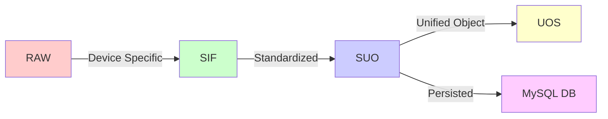

# MQTT Middleware Pro - Product Requirements Document

**Version:** 1.0  
**Date:** 2026-02-25  
**Status:** Draft

---

## 1. Executive Summary

MQTT Middleware Pro is a high-throughput integration layer that unifies data from heterogeneous IoT gateway devices (V5008/Binary and V6800/JSON) into a standardized format for real-time dashboards and historical SQL storage. The system acts as a middleware layer between IoT devices and downstream applications, providing data normalization, caching, and API access.

---

## 2. System Overview

### 2.1 Data Flow Architecture

The system processes data through a four-stage transformation pipeline:



#### Data Layer Definitions

| Layer | Description | Format |
|-------|-------------|--------|
| **RAW** | Device-specific MQTT message as received from gateway | V5008: Binary, V6800: JSON |
| **SIF** | Standard Intermediate Format - normalized device data | JSON |
| **SUO** | Standard Unified Object - enriched message with metadata | JSON |
| **UOS** | Unified Object Store - cached state for real-time access | In-Memory Cache |
| **DB** | MySQL tables for historical data storage | SQL |

### 2.2 Supported Device Types

| Device Type | Protocol | Message Format | Spec Document |
|-------------|----------|----------------|---------------|
| **V5008** | MQTT | Binary | [`V5008_Spec.md`](V5008_Spec.md) |
| **V6800** | MQTT | JSON | [`v6800_spec.md`](v6800_spec.md) |

---

## 3. Technical Stack

| Component | Technology | Purpose |
|-----------|------------|---------|
| Runtime | Node.js | Application server and message processing |
| Message Broker | MQTT Broker | Device communication and message routing |
| Database | MySQL | Historical data storage |
| Cache | In-Memory (Node.js) | Real-time state management (UOS) |
| API | REST/HTTP | Client-facing API endpoints |
| WebSocket | WebSocket | Real-time data broadcasting |

---

## 4. Core Functional Requirements

### 4.1 Message Processing Pipeline

The system must implement the following message flow:

1. **Subscribe** to device MQTT topics defined in configuration
2. **Parse** RAW messages to SIF format (device-specific parsers)
3. **Transform** SIF to SUO (enrich with metadata)
4. **Cache** SUO in UOS for real-time access
5. **Persist** SUO to MySQL for historical queries
6. **Broadcast** SUO through configurable output channels

### 4.2 Key Modules

#### 4.2.1 MQTTSubscriber
**Purpose:** Subscribe to device MQTT topics and emit raw messages

**Responsibilities:**
- Subscribe to topics defined in configuration
- Receive incoming MQTT messages
- Emit `raw.mqtt.message` events
- Handle connection failures and reconnection

**Configuration:**
- QoS Level: 1 (at least once delivery)
- Clean Session: false (maintain subscriptions)
- Subscription Pattern: Subscribe to wildcard topics (e.g., `V5008Upload/#`, `V6800Upload/#`)
- Message Acknowledgment: Auto-acknowledge after emitting `raw.mqtt.message` event
- Reconnection Strategy: Exponential backoff (1s, 2s, 4s, 8s, 16s, max 60s)

**Events Emitted:**
- `raw.mqtt.message` - Raw message payload with topic metadata

#### 4.2.2 MQTTPublisher
**Purpose:** Publish raw command messages to the broker

**Responsibilities:**
- Publish messages to device download topics
- Handle publishing failures and retries
- Queue messages during broker unavailability

#### 4.2.3 Normalizer
**Purpose:** Convert SIF to SUO and UOS formats

**Responsibilities:**
- Transform SIF messages to SUO format
- Enrich messages with metadata (timestamps, device info)
- Emit `suo.mqtt.message` events
- Update UOS cache

**Configuration:**
- Error Handling: Log malformed SIF messages, increment error counter, do not emit SUO
- Validation: Validate required fields before transformation
- Metadata Enrichment: Add serverTimestamp, deviceTimestamp (if available)
- Flattening: Apply flattening rule for V6800 multi-module messages

**Events Emitted:**
- `suo.mqtt.message` - Unified object message

#### 4.2.4 Cache (UOS)
**Purpose:** Maintain in-memory cache of device states

**Responsibilities:**
- Store latest SUO messages per device/module
- Provide fast lookup for real-time queries
- Implement cache expiration policies
- Handle cache size limits

**Configuration:**
- Cache Size Limit: 10,000 entries (configurable)
- TTL Default: 300 seconds (5 minutes)
- Eviction Policy: LRU when at capacity
- Persistence: Optional Redis backend for distributed caching
- Indexes: Maintain indexes for deviceId, moduleIndex, moduleId

#### 4.2.5 Watchdog
**Purpose:** Execute scheduled tasks

**Responsibilities:**
- Run periodic health checks
- Execute scheduled maintenance tasks
- Monitor system metrics
- Trigger alerts on threshold violations

#### 4.2.6 SmartHB (Smart Heartbeat)
**Purpose:** Process heartbeat messages and trigger associated tasks

**Responsibilities:**
- Detect heartbeat messages from devices
- Trigger device-specific tasks on heartbeat
- Update device online status
- Schedule follow-up queries (e.g., device info, module info)

**Configuration:**
- Trigger: On receipt of HEARTBEAT SIF message
- Tasks to Trigger:
  - Query device info if not in cache
  - Query module info if not in cache
  - Update device online status
- Cooldown: 5 minutes between follow-up queries for same device

#### 4.2.7 CommandService
**Purpose:** Handle command requests and convert SUO to raw format

**Responsibilities:**
- Listen for `command.request` events
- Convert SUO commands to device-specific raw format
- Publish raw commands via MQTTPublisher
- Handle command responses and acknowledgments

**Configuration:**
- Command Timeout: 30 seconds
- Retry Policy: 3 retries with exponential backoff (1s, 2s, 4s)
- Response Handling: Match response messageId to original request
- Error Handling: Log failed commands, notify via event

**Events Listens:**
- `command.request` - Command request in SUO format

#### 4.2.8 ApiService
**Purpose:** Provide REST API for client applications

**Responsibilities:**
- Handle HTTP requests
- Query UOS cache for real-time data
- Query MySQL for historical data
- Process command requests
- Return standardized JSON responses

---

### 4.3 API Endpoints

#### 4.3.1 Configuration & Health

| Method | Endpoint | Description |
|--------|----------|-------------|
| GET | `/api/config` | Retrieve system configuration |
| GET | `/api/health` | Health check endpoint |

#### 4.3.2 Real-time Data (Live)

| Method | Endpoint | Description |
|--------|----------|-------------|
| GET | `/api/live/rackshadow/devices/{deviceId}/modules/{moduleIndex}` | Get live rack shadow data for specific device and module |
| GET | `/api/live/metadata/devices/{deviceId}` | Get live metadata for a device |

#### 4.3.3 Historical Data (History)

| Method | Endpoint | Description |
|--------|----------|-------------|
| GET | `/api/history/rfidSnapshot/devices/{deviceId}/modules/{moduleIndex}?time1={start}&time2={end}` | Get RFID snapshot history |
| GET | `/api/history/temHum/devices/{deviceId}/modules/{moduleIndex}?time1={start}&time2={end}` | Get temperature/humidity history |
| GET | `/api/history/noise/devices/{deviceId}/modules/{moduleIndex}?time1={start}&time2={end}` | Get noise level history |
| GET | `/api/history/tagEvent/tags/{tagId}?time1={start}&time2={end}` | Get tag event history |
| GET | `/api/history/logEvent?time1={start}&time2={end}` | Get system log events |

#### 4.3.4 Commands

| Method | Endpoint | Description |
|--------|----------|-------------|
| POST | `/api/commands` | Submit command request to device |

**Command Request Format:**
```json
{
  "deviceId": "string",
  "deviceType": "V5008" | "V6800",
  "messageType": "string",
  "data": {}
}
```

---

### 4.4 Configurable Output Modules

These modules listen to `suo.mqtt.message` events and forward data through different channels:

#### 4.4.1 MQTTRelay
**Purpose:** Relay SUO messages to configured MQTT topics

**Configuration:**
- List of topic patterns for relaying
- Topic Transformation Rules:
  - `{deviceId}/{moduleIndex}/{suoType}` → `relay/{deviceType}/{deviceId}/{moduleIndex}`
  - Support regex patterns for custom transformations
- QoS: 1 (at least once)
- Retain: false

#### 4.4.2 WebSocket
**Purpose:** Broadcast SUO messages to connected WebSocket clients

**Configuration:**
- WebSocket server port
- Client authentication
- Message filtering rules

#### 4.4.3 Webhook
**Purpose:** POST SUO messages to registered HTTP endpoints

**Configuration:**
- List of webhook URLs
- Authentication: Bearer token or API key in headers
- Retry Policy: Max 5 retries
- Backoff Strategy: Exponential backoff (1s, 2s, 4s, 8s, 16s)
- Timeout: 10 seconds per request
- Success Criteria: HTTP 2xx status

#### 4.4.4 Database
**Purpose:** Persist SUO messages to MySQL

**Configuration:**
- Database connection settings
- Table mappings
- Batch Insert Size: 100 records per batch
- Connection Pool: 10 connections (configurable)
- Write Strategy: Async queue with worker pool
- Error Handling: Retry failed writes 3 times, then log and discard
- Data retention policies
- Partitioning: Monthly partitions for high-volume tables

---

## 5. Device Message Types

### 5.1 V5008 Device Messages

| Message Type | Direction | Description |
|--------------|-----------|-------------|
| HEARTBEAT | Device → Middleware | Device heartbeat with module status |
| RFID_SNAPSHOT | Device → Middleware | Current RFID tag states |
| TEMP_HUM | Device → Middleware | Temperature and humidity readings |
| NOISE_LEVEL | Device → Middleware | Noise level readings |
| DOOR_STATE | Device → Middleware | Door open/close state |
| DEVICE_INFO | Device → Middleware | Device information (IP, MAC, firmware) |
| MODULE_INFO | Device → Middleware | Module information and firmware |
| QUERY_COLOR_RESP | Device → Middleware | Response to color query |
| SET_COLOR_RESP | Device → Middleware | Response to set color command |
| CLEAR_ALARM_RESP | Device → Middleware | Response to clear alarm command |
| QUERY_DEVICE_INFO | Middleware → Device | Request device information |
| QUERY_MODULE_INFO | Middleware → Device | Request module information |
| QUERY_RFID_SNAPSHOT | Middleware → Device | Request RFID snapshot |
| QUERY_DOOR_STATE | Middleware → Device | Request door state |
| QUERY_TEMP_HUM | Middleware → Device | Request temperature/humidity |
| SET_COLOR | Middleware → Device | Set sensor color |
| QUERY_COLOR | Middleware → Device | Query sensor color |
| CLEAR_ALARM | Middleware → Device | Clear sensor alarm |

### 5.2 V6800 Device Messages

| Message Type | Direction | Description |
|--------------|-----------|-------------|
| DEV_MOD_INFO | Device → Middleware | Device and module initialization info |
| MOD_CHNG_EVENT | Device → Middleware | Module change event |
| HEARTBEAT | Device → Middleware | Device heartbeat |
| RFID_EVENT | Device → Middleware | RFID tag attach/detach event |
| RFID_SNAPSHOT | Device → Middleware | Current RFID tag states |
| TEMP_HUM | Device → Middleware | Temperature and humidity readings |
| QUERY_TEMP_HUM_RESP | Device → Middleware | Response to temperature/humidity query |
| DOOR_STATE_EVENT | Device → Middleware | Door state change event |
| QUERY_DOOR_STATE_RESP | Device → Middleware | Response to door state query |
| SET_COLOR_RESP | Device → Middleware | Response to set color command |
| QUERY_COLOR_RESP | Device → Middleware | Response to color query |
| CLEAR_ALARM_RESP | Device → Middleware | Response to clear alarm command |
| QUERY_DEV_MOD_INFO | Middleware → Device | Request device/module info |
| QUERY_RFID_SNAPSHOT | Middleware → Device | Request RFID snapshot |
| QUERY_DOOR_STATE | Middleware → Device | Request door state |
| QUERY_TEMP_HUM | Middleware → Device | Request temperature/humidity |
| SET_COLOR | Middleware → Device | Set sensor color |
| QUERY_COLOR | Middleware → Device | Query sensor color |
| CLEAR_ALARM | Middleware → Device | Clear sensor alarm |

---

## 6. Non-Functional Requirements

### 6.1 Performance

| Requirement | Target |
|-------------|--------|
| Message Processing Latency | < 100ms per message |
| API Response Time (Live Data) | < 50ms |
| API Response Time (Historical Data) | < 500ms |
| Throughput | Support 1000+ messages/second |
| Concurrent Connections | 100+ WebSocket clients |

### 6.2 Reliability

| Requirement | Target |
|-------------|--------|
| System Uptime | 99.9% |
| Message Delivery | At-least-once delivery guarantee |
| Data Persistence | ACID compliance for database writes |
| Automatic Recovery | Auto-reconnect to MQTT broker on failure |

### 6.3 Scalability

| Requirement | Target |
|-------------|--------|
| Device Support | Support 1000+ concurrent devices |
| Module Support | Support 5000+ modules across all devices |
| Database Growth | Handle 1M+ records per day |
| Horizontal Scaling | Support multiple middleware instances |

### 6.4 Security

| Requirement | Target |
|-------------|--------|
| MQTT Authentication | TLS/SSL encryption, username/password |
| API Authentication | JWT token-based authentication |
| Data Validation | Input validation and sanitization |
| Access Control | Role-based access control (RBAC) |

### 6.5 Maintainability

| Requirement | Target |
|-------------|--------|
| Code Structure | Modular, testable architecture |
| Logging | Structured logging with correlation IDs |
| Monitoring | Health checks, metrics, and alerts |
| Documentation | API documentation (OpenAPI/Swagger) |

---

## 7. Configuration

The system must support configuration through:

1. **Configuration File** - JSON/YAML file for static settings
2. **Environment Variables** - For sensitive data (passwords, API keys)
3. **Runtime Configuration** - API endpoints for dynamic configuration updates

### 7.1 Required Configuration Sections

| Section | Description |
|---------|-------------|
| `mqtt` | MQTT broker connection settings |
| `database` | MySQL connection settings |
| `devices` | Device topic subscriptions and mappings |
| `cache` | UOS cache settings (size, TTL) |
| `api` | API server settings (port, authentication) |
| `websocket` | WebSocket server settings |
| `webhooks` | Webhook URL list and retry policies |
| `modules` | Enable/disable configurable modules |

---

## 8. Error Handling

### 8.1 Message Processing Errors

| Error Type | Handling Strategy |
|------------|-------------------|
| Invalid Message Format | Log error, discard message, increment error counter |
| Missing Required Fields | Log warning, use default/null values |
| Device Not Found | Log error, return 404 for API requests |
| Parse Failure | Log error with raw payload, discard message |

### 8.2 System Errors

| Error Type | Handling Strategy |
|------------|-------------------|
| MQTT Connection Lost | Attempt reconnection with exponential backoff |
| Database Connection Lost | Queue writes, attempt reconnection |
| Cache Overflow | Evict oldest entries, log warning |
| API Rate Limit | Return 429 status with retry-after header |

---

## 9. Deployment Considerations

### 9.1 System Requirements

| Component | Minimum | Recommended |
|-----------|---------|-------------|
| CPU | 2 cores | 4+ cores |
| RAM | 4 GB | 8+ GB |
| Disk | 20 GB | 50+ GB SSD |
| Network | 100 Mbps | 1 Gbps |

### 9.2 Deployment Architecture

```
┌─────────────────────────────────────────────────────────┐
│                     MQTT Broker                         │
│                  (Mosquitto/EMQX)                       │
└────────────────────┬────────────────────────────────────┘
                     │
        ┌────────────┼────────────┐
        │            │            │
┌───────▼──────┐ ┌──▼────────┐ ┌─▼────────────┐
│   V5008      │ │   V6800   │ │  Other       │
│   Devices    │ │  Devices  │ │  Devices     │
└──────────────┘ └───────────┘ └──────────────┘

┌─────────────────────────────────────────────────────────┐
│              MQTT Middleware Pro                        │
│  ┌──────────────────────────────────────────────────┐  │
│  │  MQTTSubscriber → Normalizer → Cache → DB       │  │
│  │  CommandService ← ApiService                    │  │
│  │  MQTTRelay │ WebSocket │ Webhook               │  │
│  └──────────────────────────────────────────────────┘  │
└────────────────────┬────────────────────────────────────┘
                     │
        ┌────────────┼────────────┐
        │            │            │
┌───────▼──────┐ ┌──▼────────┐ ┌─▼────────────┐
│   Dashboard  │ │   Mobile  │ │  3rd Party   │
│   App        │ │   App     │ │  Systems     │
└──────────────┘ └───────────┘ └──────────────┘
```

### 9.3 Deployment Options

1. **Single Instance** - For small deployments (< 100 devices)
2. **High Availability** - Multiple instances with load balancer
3. **Docker/Kubernetes** - Containerized deployment with orchestration

---

## 10. Monitoring & Observability

### 10.1 Metrics to Track

| Category | Metrics |
|----------|---------|
| Message Processing | Messages received, processed, failed, latency |
| API Performance | Request count, response time, error rate |
| Device Status | Online/offline count, last heartbeat time |
| System Health | CPU, memory, disk usage, uptime |
| Database | Query performance, connection pool usage |

### 10.2 Logging Requirements

- Structured JSON logging
- Log levels: DEBUG, INFO, WARN, ERROR
- Include correlation IDs for request tracing
- Log rotation and retention policies
- Centralized log aggregation (ELK/Loki)

---

## 11. Testing Requirements

### 11.1 Unit Tests

- Message parsing (RAW → SIF)
- Message transformation (SIF → SUO)
- Cache operations
- API endpoint handlers

### 11.2 Integration Tests

- End-to-end message flow
- Database operations
- MQTT broker communication
- WebSocket connections

### 11.3 Performance Tests

- Message throughput under load
- API response time under concurrent requests
- Cache performance with large datasets

---

## 12. Future Enhancements (Out of Scope for v1.0)

- Support for additional device types
- Machine learning for anomaly detection
- Advanced analytics and reporting
- Multi-tenant support
- GraphQL API
- Message replay functionality
